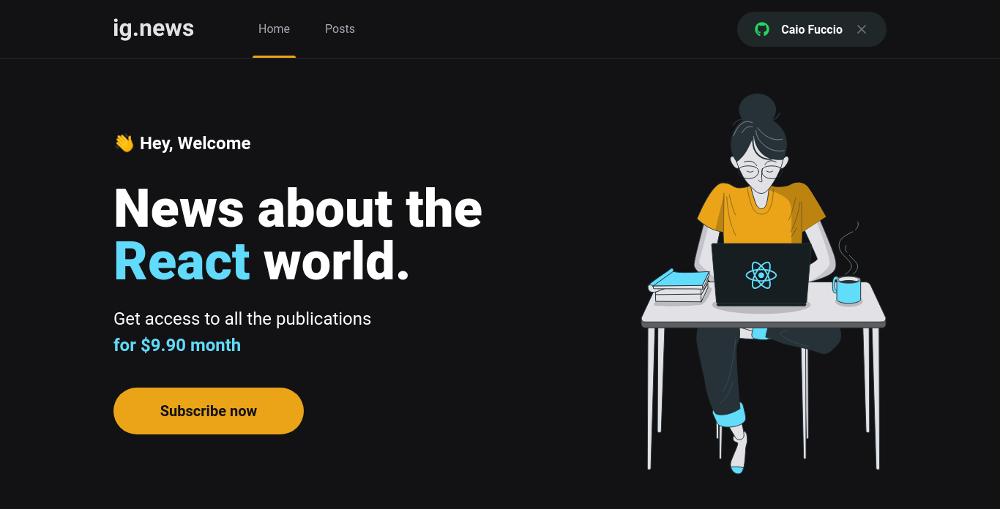
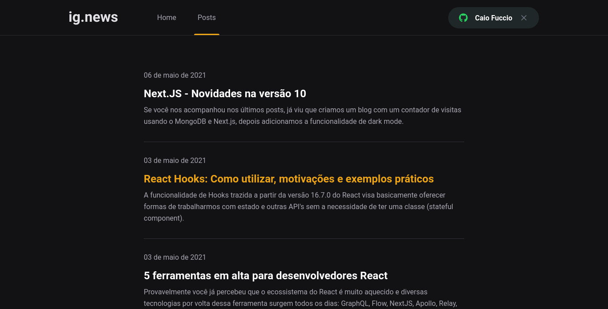
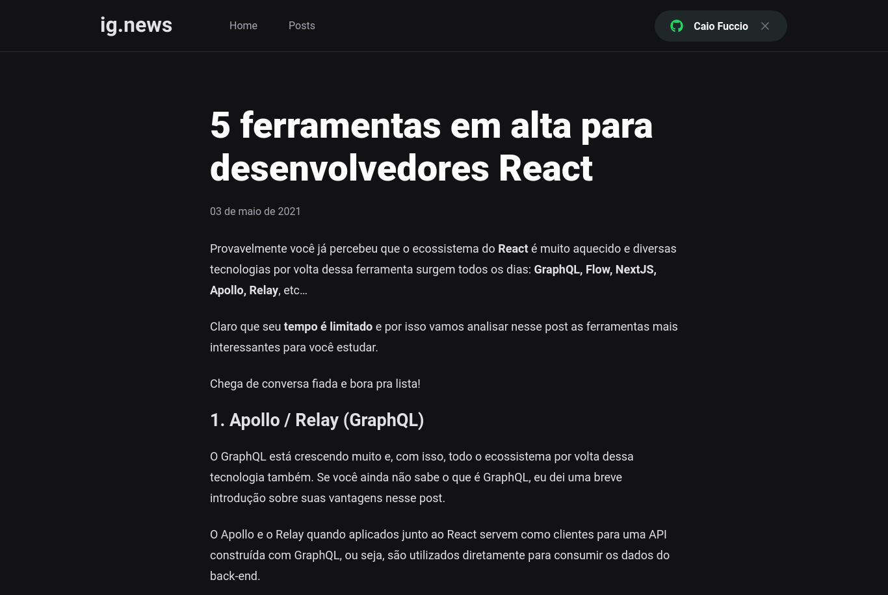
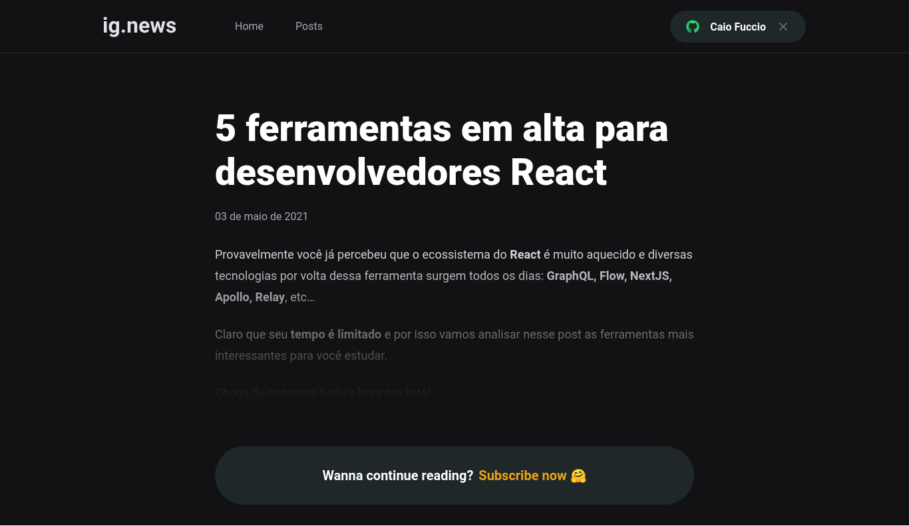

	
	
  
  
  <a href="https://github.com/caiofuccio">
	  
	<a/>
  

 

<h1  align="center">
  
</h1>
 

 <a href="#-sobre">Sobre</a> •
 <a href="#%EF%B8%8F-features">Features</a> •
 <a href="#%EF%B8%8F-layout">Layout</a> • 
 <a href="#-como-executar">Como executar</a> • 
 <a href="#-tecnologias">Tecnologias</a> • 
 <a href="#-autor">Autor</a> •
 <a href="#%EF%B8%8F-licença">Licença</a>

 

<h4 align="center"> 
	🎊   Finalizado   🎊
</h4>
 

---

## 💻 Sobre

O ig.news é uma aplicação web que agrupa notícias e postagens de blogs com novidades sobre a ferramenta React para desenvolvimento web. Para ter acesso às notícias é necessário que o usuário se cadastre com uma conta do GitHub e faça uma assinatura mensal no valor de USD $9,90 utilizando um cartão de crédito.

Essa aplicação é um dos desafio proposto pela RocketSeat na trilha de React do bootcamp Ignite de 2021.

 

---

## ⚙️ Features

Página Home:

- [x] Cadastro e autenticação do usuário usando uma conta do GitHub
- [x] Inscrição do usuário usando a plataforma de pagamentos Stripe
- [x] Redirecionamento para a página de cadastro caso um usuário não logado tente fazer uma assinatura.
- [x] Redirecionamento para a página de posts caso um assinante tente fazer uma nova assinatura.

Página Posts:

- [x] Lista todos os posts publicados com título e primeiro parágrafo.
- [x] Caso o usuário não esteja logado e clique em um post ele é redirecionado para a home.
- [x] Caso o usuário esteja logado e não seja assinante, ele é redirecionado para a página de preview da matéria, que mostra os três primeiros parágrafos e um botão para inscrição.
- [x] Caso o usuário esteja logado e seja assinante, ele tem acesso completo ao post.

 

---

## 🖼️ Layout

<strong>Página Home</strong>

<strong>Página de Posts</strong>

<strong>Página completa do post</strong>

<strong>Página preview do post</strong>

 

---

## 🧰 Como executar

## Pré requisitos

Antes de começar, você vai precisar criar uma conta, caso ainda não possua nos três serviços abaixo, utilizados na construção dessa aplicação:

- FaunaDB: banco de dados usado para armazenar os dados dos usuários cadastrados e das assinaturas. É otimizado para aplicações serverless.
- Stripe: plataforma de pagamento que permite os usuários fazerem sua assinatura usando um cartão de crédito.
- Prismic CMS: painel de administração onde serão escritos os posts. Eles são carregados na aplicação via API.

 

    # Clone o repositório
    $ git clone git@github.com:caiofuccio/ignews.git

    # Instale as dependências
    $ yarn

    # Execute a aplicação em modo de desenvolvimento
    $ yarn dev

    # A aplicação será aberta na porta:3000 - acesse https://localhost:3000

 

---

## 🚀 Tecnologias

As seguintes ferramentas de programação foram usadas na construção do projeto:

 
 
 
 
 
 

 
 

Usamos também as seguintes ferramentas de terceiros:

  
  

 

---

## 👨‍💻 Autor

	
	 
	<strong>Caio Fuccio</strong>
	 
	 Front-End Developer | ReactJS - JAMStack
	 
	 
	
	

 

---

## ⚖️ Licença

Este projeto está sob a licença MIT.

Acesse o arquivo de [LICENSE](./LICENSE) para mais informações.
